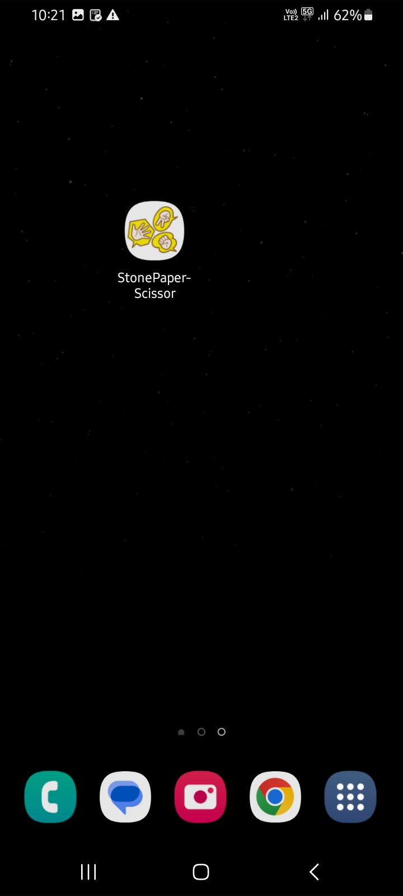
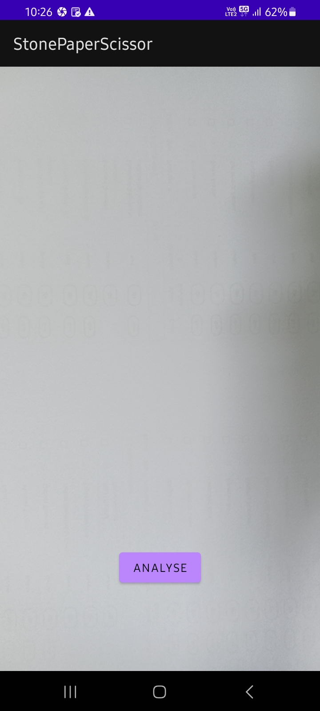
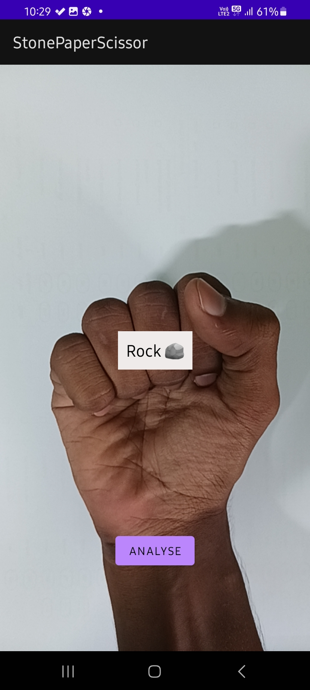
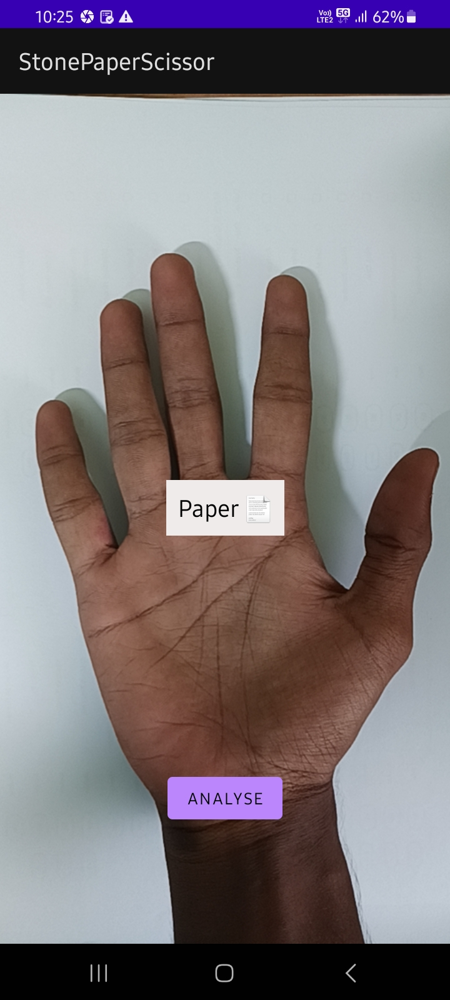
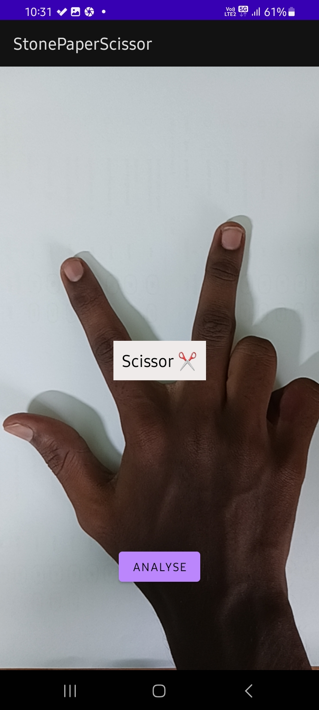

 
<h1 align="center">
  <br>
  Rock Paper Scissor
  <br>
</h1>

<h4 align="center">Deep Learning Model Trained And Deployed In Android App. </h4>

<p align="center">
    
    
    
    
</p>

<p align="center">
  <a href="#key-features">Key Features</a> •
  <a href="#how-to-use">How To Use</a> •
  <a href="#download">Download</a> •
  <a href="#contact-us">Download</a> •
  <a href="#license">License</a>
</p>

<div>
    
    
    
    
    
</div>

## Key Features

* Deeplearning Model With 88% 💪 Accuracy
* Onnx Model Is Available in [Releases](https://github.com/Muthu-Palaniyappan-OL/rock_paper_scissor/releases/latest)
* Onnx Model is deployed in Android App 📱 which is also available in [Releases](https://github.com/Muthu-Palaniyappan-OL/rock_paper_scissor/releases/latest)
* Deep Learning Model is capable of Classifying Images into 3 classes (rock ✊, paper 🤚, scissor ✌️)
* Trained in colab

## How To Use

- you can run the [rock_paper_scissor.ipynb](rock_paper_scissor.ipynb) for deeplearning model
- open the directory in android studio for devoloping the app


## Download

```sh
git clone https://github.com/Muthu-Palaniyappan-OL/rock_paper_scissor.git
```

## Contact Us

- [Muthu Palaniyappan OL](https://twitter.com/iampalaniyappan)


## License

MIT

---
